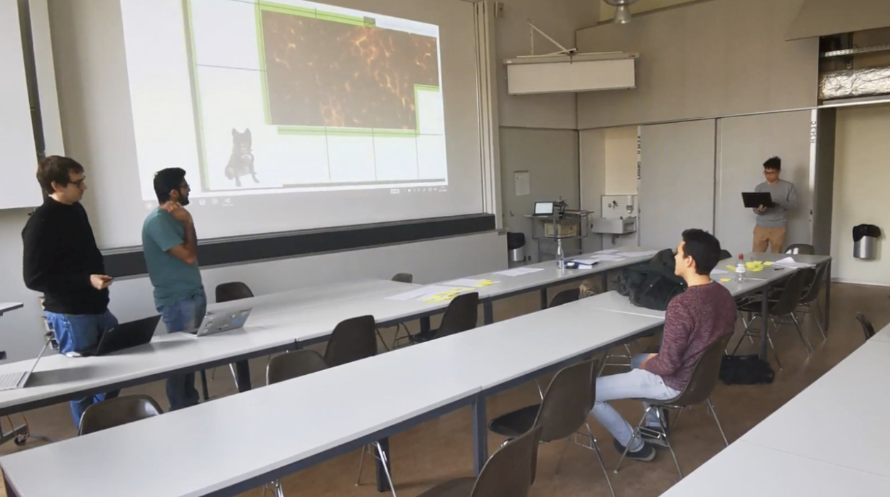
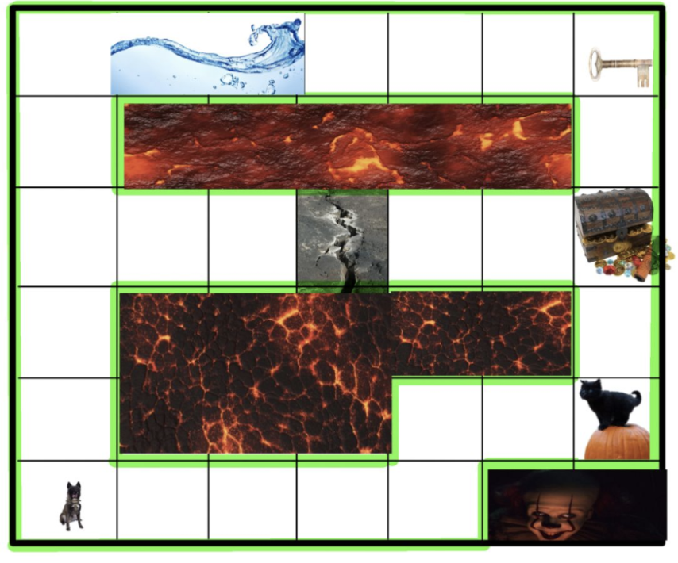
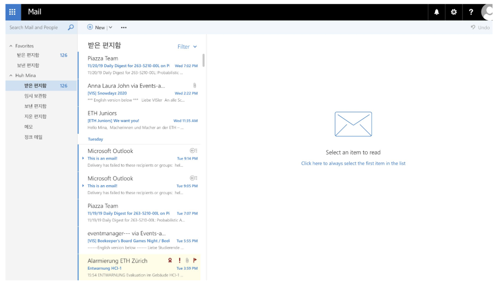

               

# MSR Voice Input, Group 3
#### Kunaal Sikka, Mina Huh, Vu Nguyen, Nicolas Carmody, Jonas Bokstaller
[Google Drive link](https://drive.google.com/drive/folders/1eqkscrVaT9hrB9F4hDENMzQEruqVRJdE?usp=sharing)

## Project description and customer needs

Users often have a hard time knowing what voice commands are available and when. There are also issues with receiving feedback from the device on whether a command was heard or interpreted properly. The goal of our project is to develop guidelines for developers to follow so that their Hololens application integrates voice commands effectively and their target audience can use the commands with ease.

Link to [User Personas](https://docs.google.com/document/d/19S1B5Kuxh-lI8tsHfoAEIIXfTWTcwt1xHbvo8nMF6qo/edit?usp=sharing)

Meeting notes available upon request

## Ideas

We started by creating an [affinity cluster](https://drive.google.com/open?id=1M1NF_fIWtZ3Zx_IkFPaNNmv98yLZldGE) and openly sharing our ideas on how to improve the voice recognition experience on Hololens.

After this process, we came up with a rough list of requirements based on our affinity cluster and the user personas:
1. Teaching the user
    1. a tutorial
    3. examples
    4. help menu (easy to access)
2. Commands
    1. fluid understanding
    6. intuitive and recallable
    9. optimize commands that are frequently used
3. Feedback
    1. status - fail/disconnected/confirmation
    11. specific feedback
    12. suggestions
4. UX
    1. same interface for all commands
    18. should not interfere with users field of view too much

Keeping in mind what we had learned in class about User Centered Design, we went out to optimize the Hololens experience so that users could more effectively engage with voice functions. We wanted to create a unified experience that would work across multiple scenarios. Our goal was to increase the utilization of voice commands in such a way that users could complete everday tasks more quickly and with ease. 

An evaluation of the history of introducing new interaction devices (in particular, the mouse and GUI) led us to believe that a great way to get users more comfortable with voice input would be to have them play a game. A game that gives the user a way to train the key voice input commands could be an elegant way of teaching the user how to interact with the system. A game is often played over and over again especially if it is received well by the audience and therefore has the potential to let the user memorize important commands and become comfortable with the usage of voice to guide a system and ask for help. 

The concept of using a game to teach the user is known from the 1990s when solitaire was used to help users interact with the computer through a mouse. Back in the 1990’s people used command lines to input data and commands before the mouse was introduced. Solitaire and other games like Minesweeper came pre-installed and helped to introduce the mouse as a way of interaction with the computer. The fact that we are still using drag and drop suggests that it worked rather well. In the case of the mouse there exist universal actions that are used in a lot of applications like for example drag and drop, right-click of navigating through a menu. These operations will most certainly also exist in the case of voice input. The game could help to use common universal commands and enforce the usage of these commands in the right context over and over again through a fun game.

In addition, we set out to create a way for users to learn the game's commands easily and effectively using a virtual assistant. The virtual assistant works across different applications in the platform level. We expect the app developers to provide a list of available commands to the system so that the virtual assistant can have the required knowledge. In this way we would also lessen the learning curve for users unfamiliar with the voice commands. Thus we came up with the following goals:

1. Portray the system as a digital assistant to make users feel comfortable engaging with it via voice
1. Teach users application specific voice commands with a game
1. Have the users complete a basic task (like send an email) and compare mouse usage with voice usage

*Note: One might wonder why a digital assistant that can understand natural language is necessary at all, as natural language processing could be built into the apps. The fact is, apps generally do not support natural language processing, but adding some support phrases to voice assistants like Cortana is more feasible. In addition, the HoloLens voice input system listens to keywords, not full sentences. For natural language, a full processing engine such as Cortana is required.*

View our presentation introducing our ideas to our stakeholders [here](https://drive.google.com/file/d/1ktx7gp4W8LCk07orwoCCEVg4L9FhZpza/view?usp=sharing).

    
## Evaluation

In our user study, we set out to determine the effectiveness of our solution. Specifically, we had the following research questions:
Q1: What is the effect of using documentation vs being guided by a Digital Assistant on the percentage of voice commands used in a session?
Q2: What is the effect of using documentation vs being guided by a Digital Assistant on task completion performance (# errors, # references to help)?

To simulate the HoloLens environment, we use a classroom. All the HoloLens overlay (simulated with Windows) is projected to parts of the room (i.e. the wall). The participant can move freely within the room. The computer is operated by a person that watches the hand clicks of the participant (simulated with a laser pointer) and listens to the voice commands. The operator ignores invalid inputs. Another person simulates the digital assistant, which is activated by the participant with eye-contact or by the keyword “Hey Cortana”.

    
   Hololens Overlay Simulation

In task 1, the participant plays a simple game with voice commands only. Here, we measure the performance of the participant (Number of invalid commands, number of referrals to the documentation, time to complete). 

    
   Game Task

In task 2, the participant is tasked to send an email using the Windows Mail app. The participant may use voice commands or hand input. Here, we measure the performance (as in task 1), plus the number of gaze/hand inputs versus voice. 

    
   E-mail Task

After the completion of both tasks, the participant fills in a questionnaire that records demographic information, and both graded and textual feedback on the various input and teaching methods.

#### Deliverables:

[Study Report](/Deliverables/Study_Report.pdf)

[User Study Presentation](/Deliverables/User_Study_presentation.pdf)

[Post-Experiment Questionnaire](https://docs.google.com/forms/d/11-0nStA7Ju8s_jPijFY3YNpyKCFENe0J3qi75lEZhOU/edit)

#### Stakeholder Feedback:
On Wednesday, November 27th we had the chance to discuss the study and main findings with Sophie from Microsoft. We had a talk and how the prototype and the corresponding experiment should be altered based on our results. To further improve our study and the report we have to do the following things:
- Add a more detailed description in the study report that first-time readers get an intuition on how the experiment was done.
- Implement some video snippets from the experiment.
- To improve the experiment we have to get a better balance between the length of the documentation vs. the fairy because the instruction of the fairy takes longer than reading the documentation.
- Add more variety of speech samples.
- State the conditions more clearly on what circumstances the experiments were done.

## Final solution

[Prototype video](https://drive.google.com/open?id=19EmCCaWTRd8ljtICCJJSqCO1ZJd4U5Uy)
Since it was difficult to show our strategies with an actual Hololens, we made this video as the final prototype. 

[Presentation video](https://drive.google.com/file/d/1ChjRcP7B5skvvyCZyMsQ34FjSbp3X6NY/view?usp=sharing)
This is the video that we submitted as the presentation video

[VUI Game Prototype video](https://drive.google.com/drive/folders/1EKNlM-FKVPXuZGHqeAeGgEf5dg7hLq5z)
We used Picovoice(https://picovoice.ai) to create and learn "wake words" that are used in the game prototype. Pygame was used to create GUI part of the game. After playing this game before completing any given task, users felt more comfortable using voice interactions. 

[Final solution information](https://drive.google.com/file/d/1LM5ciOskvCM4aB6aDr2UK5nM_jBG0m0V/view?usp=sharing)

